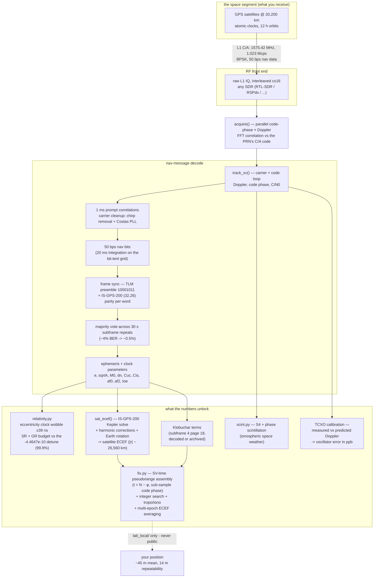
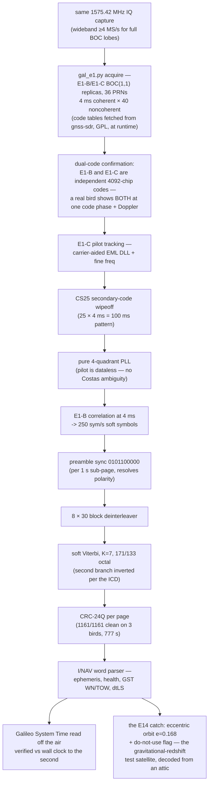

# numpy-gps 🛰️ — a software GPS *and Galileo* receiver from raw SDR IQ, in pure NumPy

Point any SDR at 1575.42 MHz, record the raw L1 hiss, and this turns it into
satellite orbits, a relativity experiment, Galileo's navigation message, and
your position. No GPS chip; just the antenna, the radio, and the math.

**Project site:** [felbs.software](https://felbs.software) · **Contact:** [E@felbs.software](mailto:E@felbs.software)

**Status: dual-constellation, jointly solved.** From captures on a cheap
active patch antenna in an attic:
- **Joint GPS+Galileo position fix: 26.8 m mean rms with 15.4 m
  repeatability** (`joint_fix.py`) — 6 GPS + 3 Galileo birds solved together
  with the inter-system time offset as a fifth unknown, Galileo pseudoranges
  assembled from I/NAV page timing on the 4 ms E1 code grid. The broadcast
  GPS-Galileo time offset (GGTO, word type 10) decodes to +6.0 ns; the
  estimated fifth unknown differs by ~180 ns of receiver BOC-vs-BPSK
  inter-signal delay — measured, documented, honest. Delightfully, including
  E14 (the "do-not-use" eccentric bird) *improves* the solution.
- **GPS position fix at ~45 m mean residual with 14 m repeatability** — full
  chain: acquisition → tracking → 50 bps nav decode → ephemerides (including
  the broadcast Klobuchar ionosphere model, decoded off the air) → sub-sample
  pseudoranges → least-squares, averaged across snapshot epochs.
- **Galileo E1-B I/NAV fully decoded** — 1161/1161 pages CRC-clean across
  three satellites, **Galileo System Time read off the air** and verified
  against the capture's own wall-clock timestamp to the second.
- One tracked bird turned out to be **E14 — one of the 2014 wrong-orbit
  eccentric satellites used for the classic gravitational-redshift tests**;
  the decoder read its elliptical ephemeris (e = 0.168) and its do-not-use
  health flag straight off the air.

## What it does
- **Decodes the GPS nav message** from your own capture — ephemeris, clock terms,
  week number, timestamps — via preamble frame-sync, IS-GPS-200 parity, and a
  majority vote across the 30-second subframe repeats (drives ~4% bit errors to
  ~0.5%).
- **Measures Einstein.** `relativity.py` turns the decoded orbit into the
  satellite's relativistic clock behaviour: the ±39 ns per-orbit eccentricity
  wobble, and the special + general relativity budget — which matches the GPS
  factory clock detune (−4.4647×10⁻¹⁰) to **99.9%**. Time dilation, from a wire
  in the yard.

  
- **Computes satellite positions.** `fix.py`'s ephemeris→ECEF (Kepler + all
  harmonic corrections + Earth rotation) follows IS-GPS-200 Table 20-IV and
  cross-checks in full 3D against SGP4-propagated operational TLEs (1–3 km,
  the TLEs' own accuracy).
- **Solves your position.** Coarse transmit time from a linear fit across every
  parity-clean subframe anchor (fit residual doubles as a built-in truth check:
  microseconds = healthy), sub-millisecond from a common-epoch code-phase
  snapshot, satellite clock + relativistic corrections, Sagnac rotation, and an
  exhaustive integer-millisecond search scored by residual + altitude sanity.
- **Ionospheric scintillation** (`scint.py`) — S4 + phase indices from the same
  tracking, as a space-weather bonus.
- **Digs 6 dB deeper when asked.** `lab/gps_deep_acquire.py` extends the
  1 ms acquisition to 5 ms coherent × 100 noncoherent — measured **+6 dB**
  by burying a known-good capture in calibrated noise until each search
  breaks (baseline dies at +6 dB added noise, deep still holds all 7
  satellites there, plus one more the baseline never saw). Lab-grade for
  now — not yet the automatic fallback in `locate.py`. The same file shows
  the diagnosis ladder that separates "blind antenna" from "marginal sky":
  a zero at −6 dB is a much stronger zero.

- **Hears Galileo too.** `gal_e1.py` acquires Europe's constellation from the
  same 1575.42 MHz capture — E1-B/E1-C BOC(1,1) replicas, 4 ms coherent × 40
  noncoherent integration. First light: 4 Galileo birds confirmed in the same
  90 s file as the GPS fix, each with both independent codes agreeing on code
  phase and Doppler. (Spreading-code tables are fetched at runtime from
  gnss-sdr's GPL sources with attribution — not embedded in this MIT repo.)
- **Reads Galileo's navigation message.** `gal_inav.py` is the full I/NAV
  chain: E1-C pilot tracking (CS25 secondary-code wipeoff → pure PLL) →
  E1-B 250 sym/s soft symbols → preamble sync → 8×30 deinterleave → soft
  Viterbi (K=7, 171/133 octal, second branch inverted per the ICD) →
  CRC-24Q. Includes a `--selftest` that synthesizes a complete E1 signal and
  recovers injected time exactly.
- **Calibrates your SDR's crystal.** Measured carrier Doppler minus the
  Doppler predicted from decoded ephemerides (at your solved position) gives
  the oscillator error directly — ours: +797 ppb with 2.3 Hz agreement
  across seven satellites. Every future frequency measurement inherits it.
- **Atmospheric corrections.** Troposphere always; Klobuchar ionosphere when
  the subframe-4 page-18 broadcast is caught (12.5-min cycle — capture long
  enough and it's guaranteed). `--multi N` solves at N snapshot epochs and
  averages in ECEF, with the epoch scatter reported as the honest error bar.

### Three lessons the working fix taught us (so you don't relearn them)
1. **Code phase points at the *next* code epoch** — transmit time assembles as
   `N − φ`, not `N + φ`. A sign, hidden inside 50 km of error.
2. **Code milliseconds tick on the satellite's clock, not GPS system time.**
   Assemble integer + fraction in SV time and subtract the clock correction
   *afterward* — `af0` alone spans ±0.5 ms (±150 km) if you subtract it first.
3. **Never trust `round()` for the integer millisecond.** Coarse times are
   ms-quantized per satellite; pin one reference bird and search the
   relative integers — the residuals point at a slipped bird (1 ms = 300 km
   on *its* range), so a residual-guided pass finds them in milliseconds, with
   coordinate descent and then an exhaustive window behind it. With ≥5 birds
   only the true set collapses the residuals *and* lands at a sane altitude.

## Architecture (full signal chain)


### The Galileo I/NAV chain (`gal_e1.py` + `gal_inav.py`)


## Install
```bash
git clone https://github.com/Felbs/numpy-gps.git
cd numpy-gps
pip install -r requirements.txt        # numpy + scipy, that is all
python measure.py --selftest           # proves the install with no radio, no capture
```
The self-test needs nothing but Python: it checks the C/A code generator
against the octal values printed in IS-GPS-200 and then acquires a synthetic
PRN buried at −20 dB. If that passes, the decoder works.

## Getting a capture
**Every other command needs raw L1 IQ, and no sample capture ships with this
repo — a GPS recording encodes the position and time it was made, so
publishing one publishes a location.** Record your own:

| setting | value |
|---|---|
| centre frequency | 1575.42 MHz (GPS L1) |
| sample rate | 2.048 Msps |
| format | interleaved `int16` (I,Q) — a `.cs16` file |
| length | 60 s minimum; 180 s to decode ephemerides comfortably |
| antenna | **active GPS patch** with a clear view of the sky, bias-T powered |

Any SDR tool that writes interleaved int16 will do. If you have SoapySDR
installed, `python locate.py` does the whole thing — capture, acquire, fix —
in one command.

**Already have a capture?** The readers are extension-agnostic — a SigMF
`ci16_le` recording (`*.sigmf-data`) from a USRP, a `.cs16` from an RSP, or
anything else that is raw interleaved int16 at 2.048 Msps works as-is:
```bash
python locate.py --iq gps_1575.420MHz_2.048Msps_ci16_le.sigmf-data
```
Nothing else in the sidecar is read; the rate is assumed to be 2.048 Msps
(`fix.py --fs` overrides it). Verified 8/15 on a B210 + rubidium recording
made in Europe — 7 satellites, 100 % word parity, a fix in the right city.

> **If you cloned before 2026-08-12 and got a confident, wrong position**
> (kilometres of residual, an altitude below sea level, still printed as
> `SOLVED`): that was a tracking bug that discarded the Doppler *rate*, and
> it hit high-drift satellites regardless of signal strength. `git pull`.
> The solver now also refuses to call a non-solution a fix.

> An indoor capture through a window usually acquires nothing. GPS arrives
> below the noise floor; the antenna is the whole game.

## Run it
```bash
python locate.py                                       # one command: capture -> count -> fix
python measure.py --selftest                           # sanity, no capture needed (synthetic -20 dB)
python relativity.py --iq your_capture.cs16            # decode Einstein
python fix.py --validate                               # ephemeris->orbit->clock math, no capture needed
python fix.py --iq your_capture.cs16 --multi 15        # fix, averaged over 15 snapshot epochs
python fix.py --resolve                                # re-solve from cache in seconds
python gal_e1.py  --iq your_capture.cs16               # Galileo acquisition
python gal_inav.py --iq your_capture.cs16 --prn 29     # Galileo I/NAV decode
```
`--resolve` reuses the cached pseudoranges from the last full run, so
experimenting with the solve never costs another decode.

### How long it takes
The capture is set by the sky, not the CPU: ephemeris arrives at 50 bit/s and
a fix needs three subframes from each of four satellites, so **300 s** of air
is the honest minimum for a reliable first fix (60 s gets you a satellite
count). The processing after that, on a 300 s / 2.4 GB capture:

| box | wall | note |
|---|---|---|
| many-core desktop | **~45 s** | satellites decode in parallel (one process each), sky search parallel over Doppler |
| one core (`GPSTUNA_SERIAL=1`, or a Pi) | ~3 min | same code, serial fallback |
| before 2026-08-15 | 6.5 min | serial, and the ambiguity search alone was 70 s |

The speed-ups are gated bit-for-bit — every per-epoch residual, integer
offset and coordinate on the two reference captures is unchanged. What was
*tried and rejected on measurement*: elevation-weighted least squares (worse
rms and scatter on both captures — with 6–7 birds the geometry loss beats
the noise gain; `GPSTUNA_WEIGHT=elev` still switches it on) and decoding the
sub-3.5-metric "weak" birds (one decoded fine at 37 dB-Hz and 14° elevation
and made the fix worse; one did not decode). Fifteen snapshot epochs instead
of five was the one accuracy change that measured better on both captures.

## Recreating this — the field guide

**Hardware floor:** any SDR that does 2.048 MS/s complex at 1575.42 MHz, plus
a ~$10–20 **active** GPS patch antenna powered by bias-T. An attic works; a
window works better; deep indoors gets 1–3 birds (not enough). 7–12 birds is
normal with sky view.

**Capture recipes (each unlocked something):**
- **90 s @ 2.048 MS/s** → GPS fix. Enough for ephemerides (subframes repeat
  every 30 s) and multi-epoch averaging.
- **13 min** → the ionosphere page. Klobuchar terms live in subframe 4
  page 18, broadcast once per 12.5 minutes — a short capture will usually
  miss them (ours did). One long capture per day is plenty; the terms are
  constellation-wide and change slowly (`fix.py` archives and reuses them).
- **Wideband (4 MS/s+)** → Galileo. E1's BOC(1,1) main lobes sit at
  ±1.023 MHz, exactly on a 2.048 MS/s capture's edge; at 2.048 you'll only
  see strong birds several dB down, at 4.096 you get the real constellation.

**Hard-won lessons (each one was a bug or a discovery here):**
1. *Assemble pseudoranges in satellite-clock time.* Code epochs align to the
   SV's own millisecond boundaries; apply clock corrections after the
   integer+fraction assembly, never before (af0 alone spans ±150 km).
2. *Code phase points at the next code epoch* — transmit time is N − φ.
3. *Never trust `round()` for the integer millisecond* — pin one reference
   bird and exhaustively search relative integers, scored by residual +
   altitude sanity.
4. *Interpolate the correlation peak.* An integer-sample code phase is ±73 m
   of quantization at 2.048 MS/s; a three-point parabola through the peak
   collapsed our epoch scatter from 79 m to 14 m. The cheapest accuracy you
   will ever buy.
5. *Validate orbits in full 3D* against SGP4-propagated TLEs — a radius-only
   check passes with the ascending node pointing the wrong way.
6. *The first couple of minutes of a fresh capture may be junk* (AGC and
   thermal settle, buffering) — our 13-minute capture was corrupted early and
   pristine (100% word parity) late. Judge segments separately; count your
   stream's overflow returns.
7. *Sub-frame word arrays are 0-indexed from TLM* — subframe "word 3" is
   `W[2]`. Our page-18 parser looked in word 4 for a whole night.
8. *A decode that matches truth through a broken frame sync is luck, not
   skill.* Re-derive, don't celebrate early.

**Know your radio's clocks (this bites EVERY SDR, differently):**
Your SDR has one physical oscillator, but it reaches your measurements down
two different paths — the sample clock (which sets code-phase timing) and
the LO (which sets carrier frequency/phase) — and GPS is precise enough to
see every imperfection in both. Three calibrations, each measured *with the
GPS signals themselves* (no extra equipment):

1. **Absolute oscillator offset.** Measured carrier Doppler minus the
   Doppler predicted from decoded ephemerides at your solved position: the
   common offset across all birds is YOUR crystal's error. Ours (RSPdx TCXO):
   +797 ppb, agreeing to 2.3 Hz across seven satellites. An RTL-SDR's cheap
   crystal can be 10–50 **ppm** — 50× our error — so widen your acquisition
   Doppler search (±30 kHz+) until you've measured it, then correct and
   narrow. Symptom of ignoring it: acquisition finds nothing, or every bird
   sits at a suspicious common Doppler offset.
2. **Code-clock vs carrier-clock split.** Here's the subtle one — we found
   it because carrier smoothing "mysteriously" lagged ~300 m. Diagnostic:
   compute code-minus-carrier (CMC) per satellite. Real physics (ionosphere)
   makes CMC drift *differently* per bird, slowly, sub-mm/s. Our CMC drifted
   **−5.956 m/s identically on all nine birds of both constellations** —
   identical-everywhere means it's the receiver, not the sky: the sample
   clock and LO paths differ by 19.87 ppb in this capture. Fix: fit the
   common CMC slope and remove it globally before Hatch smoothing. Different
   SDR architectures (fractional-N synthesis, resamplers, separate clock
   domains) will show different splits — measure yours, don't assume zero.
3. **Timing self-checks are free.** The nav-message anchor fit (file-time vs
   satellite-time across subframes) should have MICROSECOND residuals — if
   yours are worse, suspect dropped samples (count your stream API's
   overflow returns!) before blaming the math. Rapid device open/close
   cycles can also wedge some SDRs' driver services (ours needs a service
   restart + open-by-enumerated-serial afterwards).

**The accuracy ladder, honestly:** 57 m (first fix) → 43 m (troposphere +
decoded ionosphere) → 45 m mean with 14 m epoch scatter (sub-sample code
phase + 8-epoch ECEF averaging) → **27 m mean / 12 m scatter** (joint
GPS+Galileo + carrier-phase Hatch smoothing, `hatch.py`). Next rungs: WAAS
corrections, measurement-centroid de-smearing, a calibrated inter-signal
delay.

## Privacy
`fix.py` writes any computed position **only** to `lab_local/` (gitignored). The
IQ captures are gitignored too (satellite geometry encodes your location). The
code is public; your coordinates never are.

## The science — and the documents that define it

GPS is one of the rare engineering systems whose *entire* radio interface is
published, for free, by the government that built it. Every constant, bit layout,
and equation in this repo is traceable to those documents — which is exactly why
a receiver can be re-derived from scratch:

- **IS-GPS-200** (*Interface Specification, NAVSTAR GPS Space Segment / Navigation
  User Interfaces*, published by the U.S. Space Force / SMC, formerly ICD-GPS-200).
  This is the master document. It gives:
  - the **C/A code**: the 1023-chip Gold codes and each satellite's G2 phase-select
    taps — `measure.py` regenerates them and self-checks against IS-GPS-200's
    published first-10-chip octals.
  - the **nav-message format**: TLM preamble `10001011`, the 30-bit words, the
    (32,26) Hamming **parity** (§20.3.5.2), and the **subframe layouts** — bit
    positions and scale factors for every ephemeris/clock parameter. `relativity.py`
    and `fix.py` decode straight from these tables.
  - the **user algorithms** (Table 20-IV): ephemeris → ECEF satellite position
    (Kepler's equation + the harmonic corrections + Earth-rotation), and the
    **relativistic clock correction** `Δtr = F·e·√A·sin(E)` with the constant
    **F = −4.442807633×10⁻¹⁰ s/√m** used verbatim in `relativity.py`.
- **WGS-84** (the DoD World Geodetic System) supplies the Earth model: the
  gravitational parameter **μ = 3.986005×10¹⁴ m³/s²**, rotation rate
  **Ωe = 7.2921151467×10⁻⁵ rad/s**, and the ellipsoid used by `ecef_to_llh`.

### Who invented it
GPS grew out of the U.S. Department of Defense in the 1970s (the NAVSTAR program),
synthesizing earlier work like the Navy's **Transit** (Doppler positioning) and
**Timation** (satellite atomic clocks) and the Air Force's 621B. **Roger Easton**
(Naval Research Laboratory), **Bradford Parkinson** (the program's chief architect),
and **Gladys West** (whose geodetic modeling underlies WGS-84) are among its
central figures. It was declared fully operational in 1995 and opened to civilian
use — the reason this open-signal experiment is even possible.

### The relativity, in one paragraph
A satellite clock runs **slow** by ~7 µs/day from its orbital speed (special
relativity) and **fast** by ~45 µs/day from weaker gravity at altitude (general
relativity) — net **+38 µs/day**. GPS engineers pre-corrected for it by detuning
every satellite clock before launch by **−4.4647×10⁻¹⁰**. `relativity.py` computes
that same figure from the orbit *we decode ourselves* and matches it to **99.9%**;
without the correction, positions would drift **~11 km/day**. The system is, in
effect, a continuously-running verification of Einstein — and this repo reads it.

## Acknowledgments
- **IS-GPS-200 / WGS-84** — the U.S. government publishes GPS's entire radio
  interface for free; every equation here traces to those documents.
- **[laika](https://github.com/commaai/laika)** (comma.ai) — its pure-Python
  ephemeris→ECEF code was our line-by-line referee while debugging the fix.
- **[PocketSDR](https://github.com/tomojitakasu/PocketSDR)** (Tomoji Takasu),
  **[gnss-sdr](https://gnss-sdr.org/)**, and **Andrew Holme's homemade GPS
  receiver** — the open receivers whose existence proves this is doable and
  whose write-ups lit the path.
- **[python-sgp4](https://github.com/brandon-rhodes/python-sgp4)** + CelesTrak's
  operational TLEs — the independent orbit referee for validating `sat_ecef()`.

## Lineage
Built from the `radio-grid-atlas` GPS-L1 work; algorithms per **IS-GPS-200** and
**WGS-84**. Formerly published as **GPSTuna** (the old URL redirects); renamed to say what
it is - a GPS receiver written in NumPy alone, no compiled code, no GNSS library.
